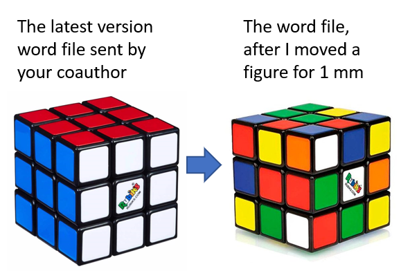
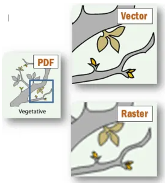

# latex-for-publication

## Motivation

Recently, I start to use less MS word, but more LaTex to edit research reports or manuscripts for journals/conferences.

I encourage more people to use LaTex, especially for the ones who need to write report regularly.

Here is a very brief guide of how to learn, use, and collaborate with LaTex if you are very new to LaTex.


## What is LaTex?

> LATEX (pronounced LAY-tek or LAH-tek) is a tool used to create professional-looking documents. It is based on the WYSIWYM (what you see is what you mean) idea, meaning you only have focus on the contents of your document and the computer will take care of the formatting. Instead of spacing out text on a page to control formatting, as with Microsoft Word or LibreOffice Writer, users can enter plain text and let LATEX take care of the rest. -- source from ['overleaf']([overleaf](https://www.overleaf.com/learn/latex/Learn_LaTeX_in_30_minutes#What_is_LaTeX.3F))

Here is an example of simple LaTeX code, test how familiar it looks like from your programming language knowledge:

```tex
\documentclass{article}

\begin{document}
First document. This is a simple example, with no 
extra parameters or packages included.
\end{document}
```

## How to learn LaTeX?

Currently, there are two main sources, where you can find lots of LaTex information

1. [Overleaf document](https://www.overleaf.com/learn) : best place to start if you have zero knowledge of LaTex
2. [StackExchange- Tex](https://tex.stackexchange.com/) : best place to find the answer for your LaTex syntax issue

Highly recommended to start with [Learn LaTeX in 30 minutes](https://www.overleaf.com/learn/latex/Learn_LaTeX_in_30_minutes#What_is_LaTeX.3F) from Overleaf.

## IDE of LaTex

LaTex has a long history, so there are many tools or IDEs may help. However, I only would recommend the latest generation software, the tools which able to work with Source Version Management (such as Git), and able to work in a collective way with your coauthors.

The tools which can satisfy above considerations only left two major options:

1. Overleaf.com: like the `google document`, but with LaTex syntax, very powerful.
2. [VScode + LaTeX workshop extension](https://marketplace.visualstudio.com/items?itemName=James-Yu.latex-workshop): if you are a 'professional' developer, you may want to stay with a 'professional' IDE.  VScode + LaTeX workshop extension can be a satisfy choice: remain the same workflows as what you do for programming, so not much different experience as you are writing your python script. Furthermore, if you are already a VScode user, I don't need to highlight how much power, that the VScode extension ecosystem can provide.

If I work alone, I would go for *VScode + LaTeX workshop extension* for 100%. If need to work with coauthor who may not familiar with programming setup, I would recommend *Overleaf*, it would be a more comfortable experience. Overleaf can sync with Github, so there is no way to stop you working with your favourite programming setup while let you coauthor stay with *Overleaf*.

Let me summarise the core add-value of using LaTex with the two recommended tools:

- Save the working progress gracefully (with the help of SVM)
- Track the changes from each author, know who edit what, and when. You always have choice to discuss the changes, and able to roll it back if not comfortable with the change.
- Format the document very satisfactory, which make you enjoy more for writing, and frustrate less for formatting.


I believe most of us have experience this kind of frustration with word, this can be avoid in LaTex.



## What you should be careful if targeting to publish

### LaTex template

Most of the journals are providing their LaTeX templates, embodied with their format requirements such as reference format, fonts, etc.

Where to find these LaTex template?

Search the information/guide for authors from the journal website, such as 

Example of full package of guide for authors - use of LaTex template

https://www.elsevier.com/authors/author-schemas/latex-instructions

### Figures

How do you feel when you saw a blur (low resolution) figure in a paper? 

How do you feel when the author had not noted the meaning and unit at XY axis?

These kind of problems are very likely to stop the reader to read the rest of your contents.

So the high quality journals will reject you if can not supply figure (artwork) with requirements.

Where to find these requirements?

Example of full package of guide for authors

https://www.elsevier.com/journals/learning-and-instruction/0959-4752/guide-for-authors

Example of full package of guide for authors - artwork

https://www.elsevier.com/journals/learning-and-instruction/0959-4752/guide-for-authors


**The best standard for artwork is from IEEE, if you can satisfy this standard, you artwork should be approved from other journals.**

https://www.ieee.org/content/dam/ieee-org/ieee/web/org/pubs/eic-guide.pdf


#### How to prepare your figures with Python

In case you are using Python, matplotlib, seaborn package to plot your figures.

Look at how do I set up the parameters before plotting

```python

import matplotlib as mpl
import matplotlib.pyplot as plt

import seaborn as sns


params = {
   'axes.labelsize': 8,
   'font.size': 6,
   'legend.fontsize': 8,
   'xtick.labelsize': 8,
   'ytick.labelsize': 8,
   'text.usetex': False,
   'figure.figsize': [4, 4],
#     'path.simplify': True, 
#     'xtick.major.size':   6,
#     'ytick.major.size':   6,
#     'xtick.minor.size':   3, 
#     'ytick.minor.size':   3,
#     'xtick.major.width'       :   1,
#     'ytick.major.width'       :   1,
#     'xtick.minor.width'       :   1,
#     'ytick.minor.width'       :   1,
#     'lines.markeredgewidth'   :   1,
    'legend.frameon'          :   False,
#     'legend.handletextpad'    :   0.3,
}
mpl.rcParams.update(params)

colors = plt.rcParams['axes.prop_cycle'].by_key()['color']

sns.set_context("paper")
sns.set(font='serif')
sns.set_style("white", {
        "font.family": "serif",
        "font.serif": ["Arial"]
    })
```

then make the plot

```python
fig = plt.figure(figsize=(4.5, 4.5))
plt.plot(history.history['loss'])
plt.plot(history.history['val_loss'])
plt.ylabel('loss - mae')
plt.xlabel('epoch')
plt.legend(['train', 'test'], loc='upper right')
fig_name=os.path.join('figs',model_name+'_1_'+'summarize history for Loss'+'.pdf')
fig.savefig(fig_name,dpi=600)
```

Watch out that I saved as PDF, with 600 dpi (IEEE required the artwork should not less than 300 DPI)

Recommend to save the figure as PDF if you can, because PDF is vector graph.

PDF image will have no problem if rescale the image.



Here is an example figure from mine work.

[link](anomalydetection_5_loss_x.pdf)

ESP is also a good vector graph format, however, it is more difficult to generate or to embed in document.


## Summary

These are some comments from me at this moment, please suggest if you spot something wrong, or know better method to recommend. Feel free to rise a issue.

Thanks,

Kind regards

Boyang
